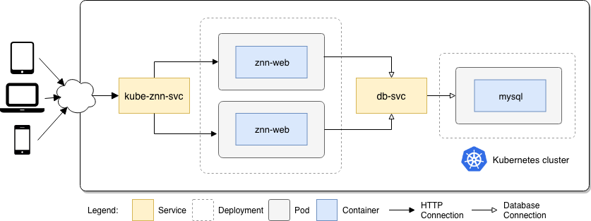

# kube-znn

Znn.com is a news service that serves multimedia news content to its customers. Kube-znn is a specialization to run znn on Kubernetes. The source code is available [here](https://github.com/cmendesce/znn).

## Run the app in Kubernetes

In this folder, just run

```sh
kubectl apply -f .
```

Run `kubectl get pod` to see the created pods. The result will looks like bellow

```sh
NAME                           READY   STATUS    RESTARTS   AGE
kube-znn-6b7f6fccbc-tv9pd      1/1     Running   0          2m19s
kube-znn-db-64d4d7dd4b-ffshl   1/1     Running   0          2m19s
```

Run `kubectl get svc` to see the created services. The result will looks like bellow

```sh
NAME          TYPE           CLUSTER-IP       EXTERNAL-IP   PORT(S)                       AGE
kube-znn      LoadBalancer   10.111.97.226    localhost     80:31752/TCP,9180:30166/TCP   8m52s
kube-znn-db   ClusterIP      10.106.151.211   <none>        3306/TCP                      8m52s
```

The front-end app is running on port [80](http://localhost:80/news.php).

## Architecture



* A front-end web app in PHP which randomly gets a news in database
* A Mysql database backed by a Docker volume

## Acknowledges

Znn.com app was originally developed by CMU Able group. The original version is available [here](https://github.com/cmu-able/znn).